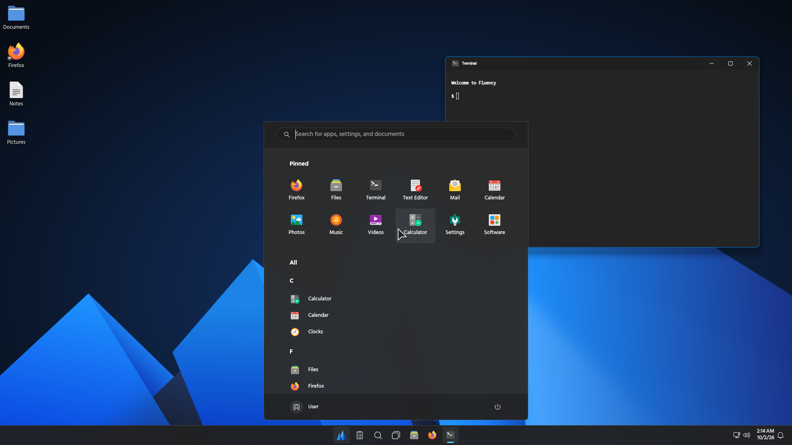

# Fluency

A desktop shell for Hyprland with elements inspired by the [Fluent design language](https://en.wikipedia.org/wiki/Fluent_Design_System). It includes a taskbar with a Start menu, a system tray, quick settings, toasts, desktop icons, jump lists, title bars with caption buttons, and minimize to the taskbar. It is built with Quickshell and Hyprland's Lua config.



Shown with the [Papirus Dark](https://github.com/PapirusDevelopmentTeam/papirus-icon-theme) icons and the Bibata Ghost cursor from [Bibata Translucent](https://github.com/Silicasandwhich/Bibata_Cursor_Translucent).

## Requirements

- Hyprland 0.56 or newer, with a Lua config (`~/.config/hypr/hyprland.lua`). A hyprlang `hyprland.conf` is refused.
- Quickshell 0.3 or newer.
- For the title bar and minimize plugins: `cmake`, `pkg-config`, a C++23 compiler, and Hyprland's headers for the version that is running.
- Runtime tools: `wl-clipboard`, `glib2` (`gio`, `gdbus`), `xdg-utils`, `systemd`, `zip`, `unzip`, `curl`, `fontconfig`.

The installer checks for all of these. Run it with `--deps` and it installs what is missing through `pacman`, `dnf`, `apt` or `zypper`, using `sudo` or `pkexec`.

Recommended, not required:

| what | package |
|---|---|
| Papirus icons | `papirus-icon-theme` (on Fedora also `papirus-icon-theme-dark`) |
| kitty, the terminal | `kitty` |
| Dolphin, the file manager | `dolphin` |
| Bibata Ghost, the cursor | none, see below |

When one of them is missing, the installer asks whether to install it from your distribution's repository. `--recommended` installs them all without asking, and `--no-recommended` skips them. Without a terminal to ask on, it only names them.

No distribution packages the cursor, so the installer downloads the Bibata Translucent 1.1.2 release from GitHub, checks its SHA-256 and puts Bibata Ghost in `~/.local/share/icons`. `--uninstall` leaves it there, like the packages.

## Install

```bash
git clone <this repository> fluency
cd fluency
./install.sh            # or ./install.sh --deps
```

The installer checks everything first and writes nothing if a check fails:

1. Hyprland and Quickshell versions.
2. Fonts. It downloads Selawik (OFL) and Fluent System Icons (MIT) at pinned versions and checks their SHA-256.
3. Plugins. The plugin headers must match the running Hyprland, then it builds both plugins.
4. Config. It builds your config with Fluency added and runs `Hyprland --verify-config` on it.

Only after all of that passes does it write:

| what | where |
|---|---|
| the shell | `~/.local/share/fluency/shell` |
| plugins | `~/.local/lib/fluency` |
| fonts | `~/.local/share/fonts/fluency` |
| config modules | `~/.config/hypr/fluency/` |
| one line appended to `hyprland.lua` | `require("fluency")` |

Your `hyprland.lua` is backed up to `hyprland.lua.bak-<time>` before the require line is added. If you have no config yet, a small starter is written.

Anything specific to your machine goes into `~/.config/hypr/fluency/local.lua`:

- your terminal
- the default browser, file manager and terminal, as the first pins. The folder handler counts as the file manager only when it is one, otherwise the first installed of Dolphin, Nautilus, Thunar, Nemo, PCManFM and Caja is used
- your icon theme. One chosen in KDE comes first, then Papirus Dark when it is installed, then the GTK default
- Bibata Ghost as the cursor when it is installed, unless your own config or environment sets another
- the NVIDIA video variables when an NVIDIA driver is loaded, otherwise the AMD ones (`radeonsi`) when `amdgpu` is loaded
- a Qt platform theme, the first one installed of qt6ct, hyprqt6engine, KDE and GTK

Running the installer again changes nothing unless something is new. If the shell is running, the installer reloads it. Otherwise it starts at your next login.

Other options:

```bash
./install.sh --dry-run      # check everything, write nothing
./install.sh --recommended  # also install Papirus, kitty, Dolphin and Bibata Ghost
./install.sh --no-plugins   # skip the title bar and minimize plugins
./install.sh --uninstall    # remove fluency and the require line
```

## Keys

| key | action |
|---|---|
| Super | Start |
| Super + Up | maximize, or restore what Super + Down minimized |
| Super + Down | minimize to the taskbar |
| Super + Ctrl + V | volume mixer |
| Alt + F4 | close the window |

## Settings

These environment variables change the defaults:

- `FLUENCY_WALLPAPER`: path to another picture.
- `FLUENCY_PINS`: comma separated desktop ids for the first Start and taskbar pins.
- `FLUENCY_TRAY_SCREEN`: the output that shows the full tray. The default is the screen at 0,0.
- `FLUENCY_DESKTOP_DIR`: the folder shown on the desktop. The default is `~/Desktop`.

## Licenses

Fluency is under the MIT license, see `LICENSE`. The title bar plugin is based on hyprbars by Vaxry (BSD 3-clause, `plugins/titlebar/LICENSE`). Selawik is under the SIL Open Font License. Fluent System Icons is under the MIT license. Both fonts are downloaded at install time and are not part of this repository. Bibata Translucent is under the GPL 3.0 and is only downloaded when you choose it.
